<h1 align="center">Profile Customization and Personalization</h1>

You can customize your Profile readme.md with Animated Svg Banners, better put it at the top of the readme, then one of the best has to be Shields.io

Animated SVG Banners are in assets/

  

  

  

  

Come check Shields.io

